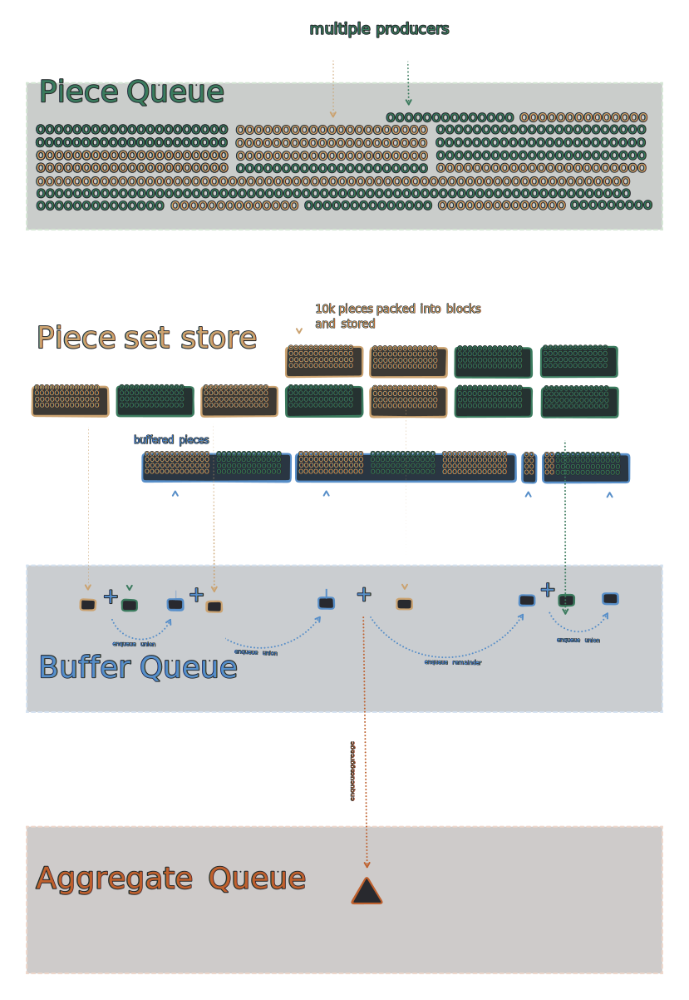

# Architecture

> The w3filecoin pipeline architecture.

## Background

[web3.storage](http://web3.storage) is a Storefront providing APIs to enable users to easily upload CAR files, while getting them available on the IPFS Network and stored in multiple locations via Filecoin Storage Providers. It relies on Spade as a broker to get their user data into Filecoin Storage Providers. Currently, Spade requires a Filecoin Piece with size between 16GiB and 32GiB to create deals with Filecoin Storage Providers. Moreover, the closer a Filecoin Piece is closer to the upper bound, the most optimal are the associated storage costs.

Taking into account that [web3.storage](http://web3.storage) onboards any type of content (up to a maximum of 4GiB-padded shards to have better utilization of Fil sector space), multiple CAR files uploaded need to be aggregated into a bigger Piece that can be offered to Filecoin Storage Providers. w3filecoin pipeline keeps track of queued CARs (cargo) to be included in Storage Provider deals.

When a CAR file is written into a given web3.storage's bucket, its piece is computed and sent into the w3filecoin processing pipeline. This pipeline is composed of multiple processing queues that accumulate pieces into aggregates and submit them into a Filecoin deal queue.

## High Level design

The high level flow for the w3filecoin Pipeline is:

- **piece inclusion request** is received by an authorized Storefront with `pieceCid`
- **piece queued** to be aggregated
- **piece buffering** until a buffer has enough pieces to become an aggregate offer
- **aggregate submission** to Storage Provider broker
- **deal tracking** and **deal recording** once fulfilled



The w3filecoin pipeline is modeled into 3 different SST Stacks that will have their infrastructure provisioned in AWS via AWS CloudFormation. These are:

- API Stack
- Processor Stack
- Data Stack


## API Stack

The w3filecoin stack has an API that authorized _Storefront_s can use in order to:

- Submit _piece_s to be included into the aggregates for which Filecoin deals are arranged.
  - `piece` is added to the `piece-store` and added to the queue processor pipeline. See [piece schema](#piece-store-schema)
- Query Filecoin deal status of the aggregate by submitted _piece_s.

And an API for the authorized deal _Broker_s in order to:

- Report failed aggregate deals

TODO add API docs

## Processor Stack

When a `piece` is submitted into the w3filecoin pipeline, its journey starts by getting queued to be included into an `aggregate` piece (large compound piece) that is offered to Storage Providers. The `Processor stack` consists of a **multiple queue system**, where individual pieces get accumulated until they can be formed into (**32GiB** piece) aggregate.

This design is built on top of the following assumptions:
- Maximum SQS batch size for standard queue is **10_000**
- Maximum SQS batch size for FIFO queue is **10**
- SQS FIFO queue garantees **exactly-once** processing
- Maximum number of pieces in a **32 GiB** aggregate is **262_144**

The `piece-queue` is the first queue in this system and is a standard SQS queue. It buffers individual pieces received into a batch of **10_000**. Once this batch is ready, a SQS consumer encodes set of pieces into a `PieceBuffer` structure (DAG-CBOR format), stores it in the `buffer-store` and submits it's CID into a second processing queue `buffer-queue`. This allows us to keep messages in the queue small.

A `PieceBuffer` consists of a buffer of pieces that are getting filled up, in order to become an aggregate ready for a Filecoin deal. See [buffer schema](#buffer-store-schema). This SHOULD allow a batch size of **10_000** to at least be able to create a buffer with size **1 GiB**.

The second queue in this system is the `buffer-queue`, a FIFO queue that acts as a reducer by concatenating the pieces of multiple buffers together generating bigger and bigger sets until one has the desirable size for an aggregate. A queue consumer can act as soon as a batch of 2 is in the queue, so that aggregates can be created as soon as possible.

The SQS consumer MUST start by fetching the `dag-cbor` encoded data of both buffers in the batch. Afterwards, their pieces SHOULD be sorted by its size and an aggregate is built with them. In case it has the desired **32 GiB** size, it should be stored in the `buffer-store` and its CID sent into the `aggregate-queue`, otherwise the new buffer should still be stored and put back into the queue. Note that:
- While pieces should be sorted by size, policies in a piece might impact this sorting. For instance, if a piece was already in a previous aggregate that failed to be stored by a Storage Provider, it can be included faster into an aggregate
- Excess pieces not included in **32 GiB** aggregate when buffers are concatenated MUST be included into a new buffer and put back into the queue
- Minimum size for an aggregate can also be specified to guarantee we don't need to have exactly **32 GiB** to offer it

Once a built aggregate reaches the desired size of **32 GiB** it is written into the `aggregate-queue`, the final stage of this aggregation multiple queue system.
Consumers for this queue can be triggered once a single item is in the batch, so that an aggregate offer can be submitted to spade and its record stored in the `aggregate-store`. See [aggregate schema](#aggregate-store-schema)

Once an aggregate offer is submitted, it can take several days until it lands into a sealed deal with a Filecoin Storage Provider. The processor MUST have a recurrent `deal-tracking` Job that polls for `offer/arrange` receipts for the `OFFERED` aggregates. Once an aggregate has an approved deal, the `inclusion-store` should be populated with all the pieces part of the successful aggregate. In case the offer failed, a new `piece-buffer` MUST be added to the appropriate queue with the pieces that did not have impact on the offer failure. The pieces that caused the failure MUST still be added to the `inclusion-store`, so that we can report their failure reason. See [inclusion schema](#inclusion-store-schema)

### Queues overview

| name      | type     | batch | window | DLQ |
|-----------|----------|-------|--------|-----|
| piece     | standard | 10000 | 300 s  | TBD |
| buffer    | FIFO     | 2     | 300 s  | TBD |
| aggregate | FIFO     | 1     | 300 s  | TBD |

Other relevant notes:
- with the approach above, we have an append only log where database writes only need to happen when information leaves or gets into the system. This results in a quite small number of operations on the DB.
- while `w3up` CAR files can be limited to `4 GiB` to have a better utilization of Fil sector space, same does not currently happen with `pickup` (and perhaps other systems in the future). Designing assuming an upper limit is not a good way to go in this system.
- current design enables us to quite easily support bigger deals in the future.
- if an aggregate fails to land into a Storage Provider, the problematic piece(s) can be removed and a buffer can be created without the problamtic piece(s). This way, it can already be added to the `buffer-queue`
- we can support different producers (e.g. web3.storage, nft.storage, ...), as well as different requirements of aggregate building and aggregate submissions (e.g. different SLA requirements) by relying on SQS `message group id`
- having a `deal-tracking` job instead of an additional queue gives us some additional benefits:
  - we can have bigger intervals between each run compared to a maximum timeout of **300 seconds** for a queue consumer, enabling us to decrease number of requests
  - we can keep track not only of deal resolution, but also instrument alerts when a status is `OFFERED` for more time than expected

## Data Stack

The Data stack is responsible for the state of the w3filecoin.

It keeps track of the received pieces, submitted aggregates, as well as in which aggregate a given piece is (inclusion). In addition, it must keep the necessary state for the `buffer-queue` to operate, as well as the state of a given aggregate over time until a deal is fulfilled. It is worth mentioning, that keeping track of problematic pieces that could not be added to an aggregate should also be properly tracked.

To achieve required state management, we will be relying on a S3 Bucket and a dynamoDB table as follows:

| store           | type     | key                      | expiration |
|-----------------|----------|--------------------------|------------|
| piece-store     | DynamoDB | `piece`                  | ---        |
| buffer-store    | S3       | `${blockCid}/{blockCid}` | 30 days    |
| aggregate-store | DynamoDB | `piece`                  | ---        |
| inclusion-store | DynamoDB | `aggregate`              | ---        |

### Queries and associayed stores

1. Check if piece is already in the pipeline (`inclusion-store` with fallback for `piece-store`)
  - Before getting a piece into the pipelined queue, it should be stored to guarantee uniqueness
  - Also important to be able to report back on the "in progress" work when deal state of a piece is still unknown by fallbacking to Head Request in bucket
2. Put and Get buffer blocks (`buffer-store`)
  - While `buffer-queue` is concatenating buffers, these blocks will be stored to be propagated through queue stages via their CIDs
  - Key `${blockCid}/{blockCid}`, Value empty with expiration date
3. Put aggregates offered to `spade` and get aggregates pending resolution (`aggregate-store`)
4. Write pieces together with the aggregate they are part of (`inclusion-store`)
5. Get deal state of a given piece (`inclusion-store` with fallback for `piece-store`)
  - Rely on DynamoDB to get `aggregate` where the piece is (secondary index) and use it ask Spade for details for the deal
  - In case there is no record in Dynamo, we can fallback to check S3 bucket, in order to reply that piece is being aggregated if it is there

TODO: metrics

### `piece-store` schema

```typescript
interface piece {
  // CID of the piece
  piece: PieceCID
  // timestamp for piece inserted
  inserted: string
  // TODO: identifier of producer to tie with `group-id`
  // TODO: identifier of tier
}
```

### `buffer-store` schema

```typescript
interface PieceBuffer {
  // Pieces inside the buffer
  pieces: Piece[]
}

interface Piece {
  piece: PieceCID
  // number of milliseconds elapsed since the epoch when piece was received
  inserted: number
  // Policies that this piece is under
  policy: PiecePolicy
}

type PiecePolicy =
  | NORMAL
  | RETRY

type NORMAL = 0
type RETRY = 1
```

### `aggregate-store` schema

```typescript
interface Aggregate {
  // CID of the aggregate
  piece: PieceCID
  // CID of the buffer resulting in the offered aggregate
  bufferCid: Link
  // invocation and task CID to be able to go through receipts
  invocation: Link
  task: Link
  // number of milliseconds elapsed since the epoch when first piece was submitted
  olderPieceInserted: number
  // number of milliseconds elapsed since the epoch when aggregate was submitted
  inserted: number
  // known status of the aggregate
  status: AggregateStatus
}

type AggregateStatus =
  | OFFERED
  | APPROVED
  | REJECTED

type OFFERED = 0
type APPROVED = 1
type REJECTED = 2
```

### `inclusion-store` schema

```typescript
interface Inclusion {
  // CID of the aggregate (primary index)
  aggregate: PieceCID
  // CID of the piece (can be secondary index)
  piece: PieceCID
  // timestamp for piece inserted
  inserted: string
  // timestamp for aggregate submission
  submited: string
  // timestamp for aggregate deal resolution
  resolved: string
  // TODO: perhaps timestamp for expired so that we can query future aggregates?
  // TODO: inclusion proof?
  // status of the deal
  status: 'APPROVED' | 'REJECTED'
  // failed reason
  failedReaon?: string
}
```

### `metrics-store` schema

TODO: we can add a different table to track Deal specific metrics if needed?
