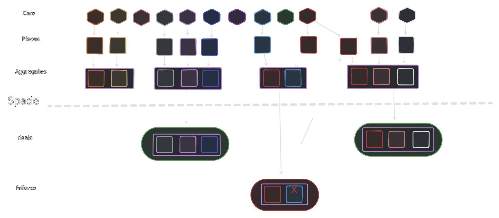
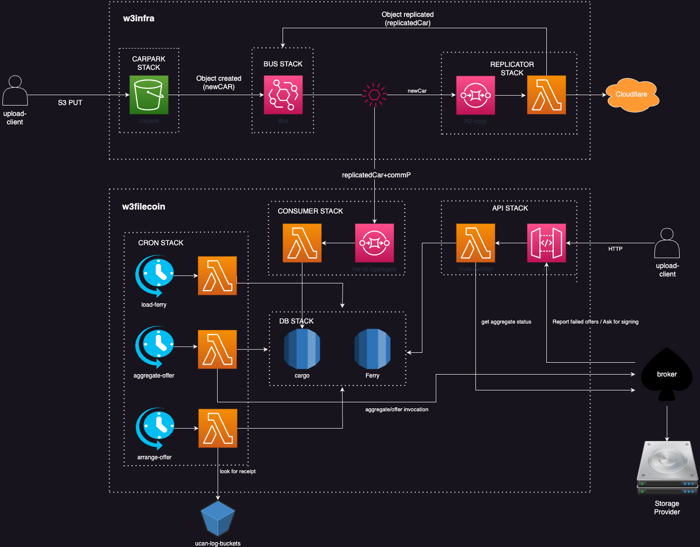
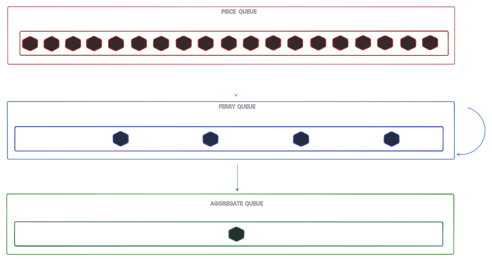
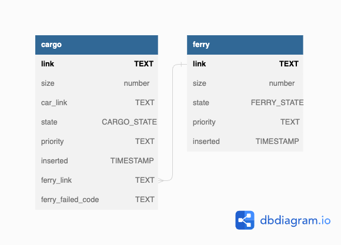

# Architecture

> The w3filecoin pipeline architecture.

## Background

[web3.storage](http://web3.storage) is a Storefront providing APIs to enable users to easily upload CAR files, while getting them available on the IPFS Network and stored in multiple locations via Filecoin Storage Providers. It relies on Spade as a broker to get their user data into Filecoin Storage Providers. Currently, Spade requires a Filecoin Piece with size between 15.875GiB and 31.75GiB to create deals with Filecoin Storage Providers. Moreover, the closer a Filecoin Piece is closer to the upper bound, the most optimal are the associated storage costs.

Taking into account that [web3.storage](http://web3.storage) onboards any type of content (up to a maximum of 4GiB-padded shards to have better utilization of Fil sector space), multiple CAR files uploaded need to be aggregated into a bigger Piece that can be offered to Filecoin Storage Providers. w3filecoin pipeline keeps track of queued CARs (cargo) to be included in Storage Provider deals.

When a CAR file is written into a given web3.storage's bucket, its metadata gets into the w3filecoin processing pipeline. This pipeline is composed of multiple processing queues, together with a job scheduler per queue that will perform the processing. Each queue handles a processing stage with the goal of getting CAR files into Filecoin deals with Storage Providers.

## High Level design

The high level flow for the w3filecoin Pipeline is:

- **Consume request** is received once a CAR file is written into a bucket with its metadata {`link`, `size`, `bucketName`, `bucketUrl`, `bucketRegion`, `key`}. This event is added to a `content_validator_queue`.
- **Content Validator process** validates CARs and writes their references to a `content` table.
- On its own schedule, **Piece maker process** can pull queued content from a `content_queue`, derive piece info for them and write records to a `piece` & `inclusion` tables.
  - a `inclusion` table enables same piece to be included in another aggregate if a deal fails.
- **Agregagtor process** reads from a `cargo_queue` (backed by `inclusion` table), attempts to create an aggregate and if successful it writes to an `aggregate` table.
- **Submission process** reads from the `aggregate_queue`, submits aggregates to the agency (spade proxy) and writes deal record with status "PENDING".
- TBD deal flow



The w3filecoin pipeline is modeled into 3 different SST Stacks that will have their infrastructure provisioned in AWS via AWS CloudFormation. These are:

- API Stack
- Queue Stack
- DB Stack
- Processor Stack



## API Stack

The w3filecoin API Stack exposes a HTTP API that both enables its to request `pieces` to be included into Filecoin deals and get status of a Filecoin deal, as well as to receive reports of aggregates that failed to land into a Filecoin Deal.

TODO
- Post piece - w3filecoin is designed to enable multiple sources of CAR files to be easily integrated into the pipeline
  - parties with permissions to write into the system can do so
- Report API for failed aggregates to land into Storage Providers
- Get to know state of deals
- ...

## Queue Stack

When a `piece` is posted into the w3filecoin pipeline, its journey starts by getting queued to be aggregated into a larger `piece` that will be offered to Storage Providers, i.e. an aggregate. The `Queue stack` consists of a **multiple queue system**, where the individual pieces will be buffered together in several stages until they are ready to form an aggregate (**32 GiB**`** piece).

This design is built on top of the following assumptions:
- Maximum SQS batch size for standard queue is **10_000**
- Maximum SQS batch size for FIFO queue is **10**
- SQS FIFO queue guarantees that a consumer will always be called with **only** messages from a given group ID as long as there are messages available in that group
- SQS FIFO queue garantees **exactly-once** processing
- Maximum number of pieces for a **32 GiB**`** aggregate is **262_144**

The `piece queue` is the first queue in this system and is a standard SQS queue. It buffers individual pieces until a batch of **10_000** is ready. Once this batch is ready, a SQS consumer will try to create smaller piece aggregates named Ferries. A ferry is a `dag-cbor` encoded data structure that contains a set of pieces that form a partial aggregate. This data structure will be stored so that only its CID is sent in SQS Messages.

```typescript
interface ferry {
  pieces: PieceLink[],
  aggregate: PieceLink
}
```

A ferry consists of a buffer of pieces that are getting filled up to become an aggregate ready for a Filecoin deal. Depending on the stage in the queue, a ferry can have a size of `1/2/4/8/16 GiB`. This SHOULD allow a batch size of **10_000** to at least be able to create a ferry with size **1 GiB**.

To create ferries from a a batch, the SQS consumer SHOULD start by sorting the received batch by `piece` size and start filling up aggregates. If an aggregate gets to its desirable size directly from the batch **32 GiB**, it should be stored and added to the `ferry queue` right away. Otherwise, the ferry is stored and added to the queue once all the batch is processed. Note that:
- when the batch was processed to build the ferry, the consumer can opt for optimizing the ferry and discard part of the pieces back to the queue (for instance, decrease its size to the previous power of 2 value).
- when a **32 GiB** is built from the initial batch, it is possible that no other ferry can get loaded with **1 GiB** of pieces. If that is the case, consumer can discard all the remaining pieces back to the queue.

The second queue in this system is the `ferry queue`. It is a FIFO queue that relies on group IDs derived from the size of a ferry. In other words, ferries are grouped together by their size and smaller ferries can be merged over and over again until reaching the desired size of **32 GiB**. Consequently, a consumer of `ferry queue` can merge multiple ferries and put them back into the queue with a group ID closer to the last stage.

The `ferry queue` buffers ferries until a batch of **10** is in the queue. This aims to reduce necessary IO and computation to get ferry content, sort and compute new ferry. However, we can rely on `maxBatchingWindow` of **5 minutes** to guarantee that ferries can continue to move forward, given a batch of `2` items is enough to merge and move to next stage.

The SQS consumer SHOULD start by fetching all the `dag-cbor` encoded data of each ferry in the batch. Afterwards, ferries should be split into pairs to be merged. Their `pieces` are sorted by size (is it needed? or can we consider it just a piece with that size?) and a new ferry is created. Once ferry is created, it can be stored and re-added to the `ferry queue` (unless reaching desired size).

The last queue in this system is the `aggregate queue`. Once a ferry reaches the desired size of **32 GiB** it is written to the `aggregate queue`. This queue is responsible to persist the pieces inclusion into the Database, as well as to set the aggregate offer ready to be submitted.



TODO:
- check if we would need to discard based on header being too big? or other way we can optimize
- should final step also be a queue `submit queue`?

Other relevant nodes:
- while `w3up` CAR files can be limited to `4 GiB` to have a better utilization of Fil sector space, same does not currently happen with `pickup` (and perhaps other systems in the future). Designing assuming maximum will be that value is not a good way to go.
- current design enables us to quite easily support bigger deals.

Challenges/compromises:
- there is not uniqueness guarantees for `piece`. Wondering if we should write the piece right away to a DB once it is received and put in the queue. This will allow us to make sure `piece` is unique in the system. But, a first write in DB would actually be needed.
  - actually this might be a good compromie for us to track `inserted` timestamp followe by the future `inclusion` timestamp.
- what to do with priority?
  - can we consider retrying deal with badcontent just with garbage?

## DB Stack

The DB stack relies on Amazon RDS Database to keep the necessary state for the w3filecoin pipeline. Its data model was designed with the aim of being the data structure for each of the processors running within the pipeline, while also enabling the tracking of state of each item in the pipeline and to get a mapping between content CIDs and piece CIDs.

### Schema

```sql
-- Table describes queue of verified CARs to be stored in filecoin
-- CAR is considered in queue when there is no piece referencing it
CREATE TABLE content
(
  -- CAR CID
  link TEXT PRIMARY KEY,
  -- CAR Size
  size number NOT NULL,
  -- Source where the content can be fetched from.
  -- It includes an array of { bucketName: string, bucketRegion: string, key: string, bucketUrl?: string }
  source JSONB NOT NULL,
  -- Timestamp
  inserted TIMESTAMP WITH TIME ZONE DEFAULT timezone('utc'::text, now()) NOT NULL
);

-- Table describes pieces derived corresponding to CARs in the content table. Link (commP) is
-- unique even though cargo reference is not, that is because there may be an error in piece
-- derivation and in that case another correct piece will reference the same content.
CREATE TABLE piece
(
  -- Piece CID
  link TEXT NOT NULL PRIMARY KEY,
  -- Piece size
  size number NOT NULL,
  -- Reference to the content of this piece (CAR CID).
  content TEXT NOT NULL REFERENCES content(link),
  -- Time when the piece was derived from the content
  inserted TIMESTAMP WITH TIME ZONE DEFAULT timezone('utc'::text, now()) NOT NULL
);

CREATE INDEX piece_content_idx ON piece (content);
CREATE INDEX piece_inserted_idx ON piece (inserted);

-- Content for which we need to derive piece CIDs. We will have a process that
-- reads from this queue and writes into `piece` table.
CREATE VIEW content_queue AS
  SELECT content.*
  FROM content
  LEFT OUTER JOIN piece ON content.link = piece.content
  WHERE piece.content IS NULL
  ORDER BY piece.inserted;

-- Table describing pieces to be included into aggregates. If aggregate is NULL then the
-- piece is queued for the aggregation.
CREATE TABLE inclusion
(
  -- Piece CID. Notice that it is not unique because in case of bad piece
  -- aggregate will be rejected and good pieces will be written back here
  -- to be included into new aggregate
  piece TEXT NOT NULL REFERENCES piece(link),
  
  -- Aggregate CID, if NULL the the piece is queued for the aggregation
  aggregate TEXT REFERENCES aggregate(link) NULL,

  -- Priority in the queue. A counter on initial inserts hence providing FIFO order.
  -- When piece is retried (after aggregate is rejected), it can keep original priority
  -- hence prioritizing it over new items yet keeping original FIFO order among rejects.
  priority NUMBER NOT NULL,

  -- Time when the piece was added to the queue.
  inserted TIMESTAMP WITH TIME ZONE DEFAULT timezone('utc'::text, now()) NOT NULL,

   -- We may also want to write inclusion proof here
);

CREATE INDEX inclusion_priority_idx ON inclusion (priority DESC, inserted);

-- Piece may end up in multiple aggregates e.g. if aggregate was rejected
-- coalesce is used to create unique constraint with null aggregate column
-- @see https://dba.stackexchange.com/questions/299098/why-doesnt-my-unique-constraint-trigger/299107#299107
CREATE INDEX piece_aggregate_unique_idx ON inclusion (piece, COALESCE(aggregate, ''));

-- Table for created aggregates. 
CREATE TABLE aggregate
(
  -- commP of the aggregate (commP of the commPs)
  link TEXT PRIMARY KEY NOT NULL,
  -- Aggregate size
  size number NOT NULL,
  -- Time when the aggregate was created
  inserted TIMESTAMP WITH TIME ZONE DEFAULT timezone('utc'::text, now()) NOT NULL
);

-- View for inclusion records that do not have an aggregate.
CREATE VIEW cargo AS
  SELECT *
  FROM inclusion
  WHERE aggregate IS NULL
  ORDER BY priority DESC, inserted;

-- State of aggregate deals. When aggregate is sent to spade-proxy status is 'PENDING'.
-- When spade-proxy requests a wallet signature, status will be updated to 'SIGNED'. Once
-- deal is accepted status changes to `APPROVED`, but if deal fails status will be set to
-- `REJECTED`.
CREATE TABLE deal (
  aggregate TEXT PRIMARY KEY NOT NULL REFERENCES aggregate(link),
  status DEAL_STATUS DEFAULT 'PENDING',
  -- if status is an error this may contain details about the error e.g. json containing
  -- piece CIDs that were invalid.
  detail JSONB,
  -- Time when aggregate was send to spade-proxy
  inserted TIMESTAMP WITH TIME ZONE DEFAULT timezone('utc'::text, now()) NOT NULL,
  -- Time when aggregate was signed
  signed TIMESTAMP WITH TIME ZONE,
  -- Time when aggregate was processed (became APPROVED or REJECTED)
  processed TIMESTAMP WITH TIME ZONE
);

CREATE INDEX deal_inserted_idx ON deal (inserted);
CREATE INDEX deal_signed_idx ON deal (signed);
CREATE INDEX deal_signed_idx ON deal (signed);
CREATE INDEX deal_status_idx ON deal (status);

CREATE TYPE DEAL_STATUS AS ENUM
(
  'PENDING',
  'SIGNED',
  'APPROVED',
  'REJECTED'
);

-- View of aggregates to be submitted to spade, that is all aggregates that we do not
-- have deal records for.
CREATE VIEW aggregate_queue AS
  SELECT aggregate.*
  FROM aggregate
  LEFT OUTER JOIN deal ON aggregate.link = deal.aggregate
  WHERE deal.aggregate IS NULL;

-- View for deals pending.
CREATE VIEW deal_pending AS
  SELECT *
  FROM deal
  WHERE status = "PENDING"
  ORDER BY inserted;

-- View for deals approved by storage providers.
CREATE VIEW deal_approved AS
  SELECT *
  FROM deal
  WHERE status = "APPROVED"
  ORDER BY processed;

-- View for deals rejected by storage providers.
CREATE VIEW deal_rejected AS
  SELECT *
  FROM deal
  WHERE status = "REJECTED"
  ORDER BY processed;
```


https://dbdiagram.io/d/649af07402bd1c4a5e249feb

## Processor Stack

The w3infra processor stack manages several concurrent workflows, deployed as lambda functions, that move items from one stage of the pipeline into another. Each workflow operates independently and on its own schedule, pulling items from one DB stack queue, and pushing into another after some processing.

The workflows running in these pipeline are:

1. **Content Validator workflow** validates CARs and writes references to `content` table.
2. **Piece maker workflow** pulls queued content from `content_queue`, derive piece info for them and write records to the `piece` & `inclusion` tables.
3. **Aggregator workflow** reads from the `cargo` view, attempts to create an aggregate and, if successful, writes to aggregate table.
4. **Submission workflow** reads from the `aggregate_queue`, submits aggregates to the agency (spade proxy) and writes pending deal record.
5. **Deal workflow** ... TBD